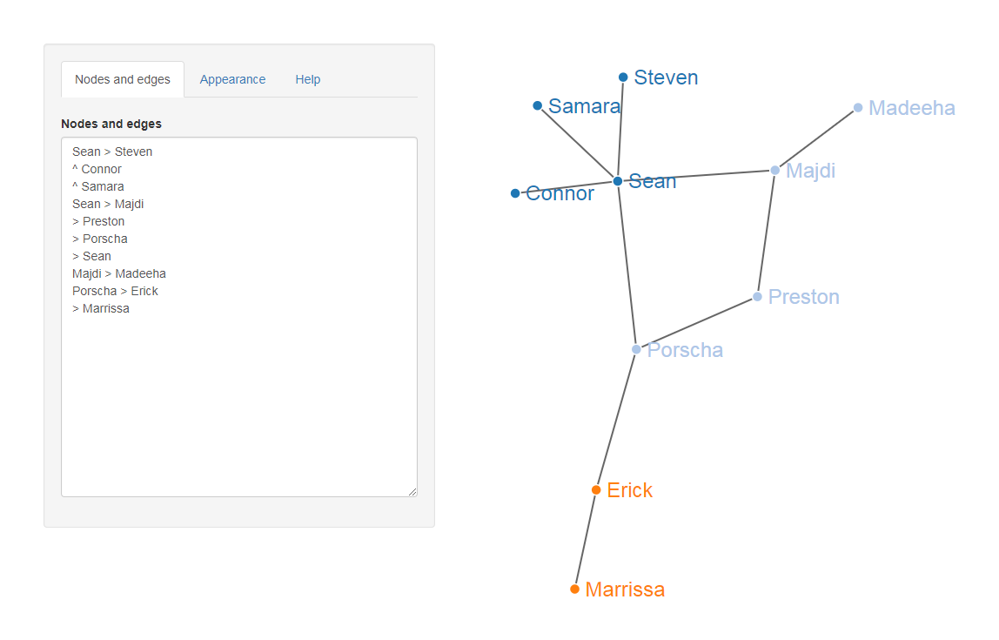

# Vertextual: Build directional networks and mindmaps from plain text

## Try it at <http://bit.ly/vertextual>

Vertextual is a tool for interactively drawing networks and 
mindmaps by writing out the nodes and connections in a simple shorthand domain-
specific language (DSL).

---

In Vertextual, you build a network by naming its nodes and their edges 
(connections). The first edge always has to be fully defined as 
`Origin > Destination` like so:

    Daydream > Idea

Each new edge goes on a new line. You can continue writing full definitions for 
the rest of the edges, or you can reuse the last `Destination` node as the new 
`Origin` by omitting the `Origin` from the new definition:

    Daydream > Idea
    > Sketch
    > Prototype
    
Is identical to:

    Daydream > Idea
    Idea > Sketch
    Sketch > Prototype
    
You can also reuse the last `Origin` as the new `Origin` with the operator `^`:
                    
    Daydream > Idea
    ^ Sketch
    ^ Prototype
    
Is identical to:

    Daydream > Idea
    Daydream > Sketch
    Daydream > Prototype
    
Circular networks can be made by looping back to an already-existing node. Bi-directional edges and even self-loops can be made too.

    # A bi-directional loop
    Polish > Refine
    > Polish

    # A self-loop
    Daydream > Daydream
    
You can name connections in any order. Duplicate connections will be automatically removed.

---

Written in [R Shiny](https://shiny.rstudio.com/) by Desi Quintans, project began on 2019-03-16.
